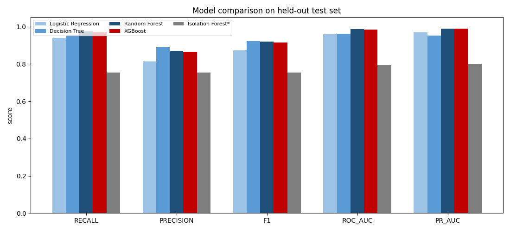
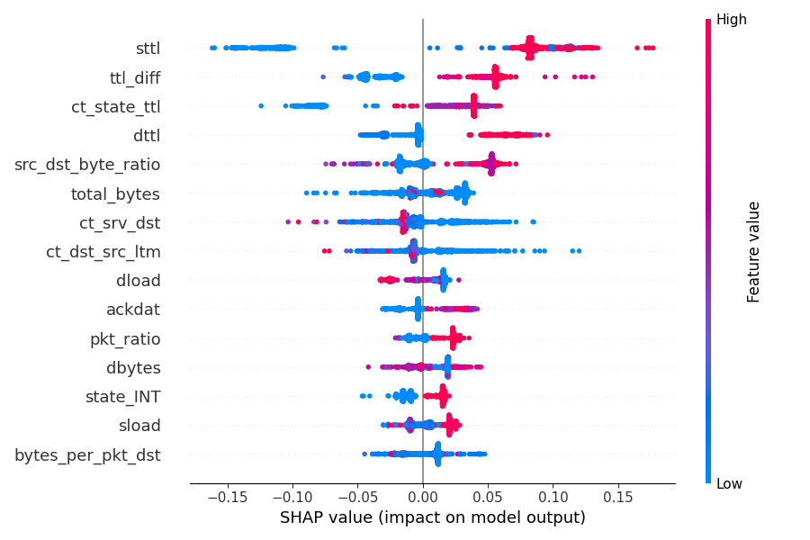
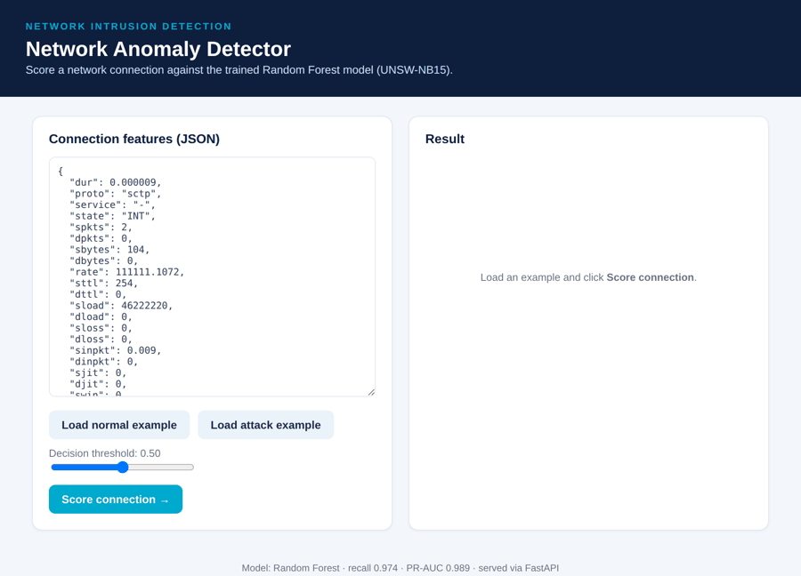
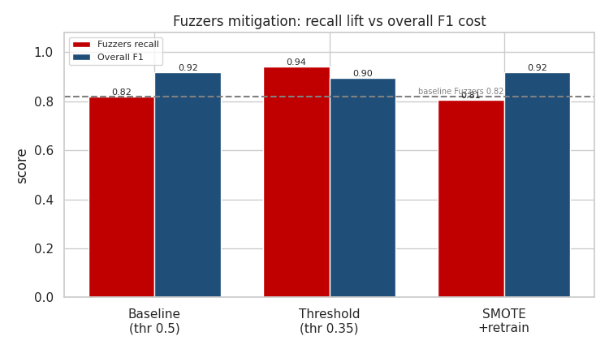

# Detecting Anomalies in Network Traffic


An end-to-end machine-learning project for **network intrusion detection** on the
[UNSW-NB15](https://research.unsw.edu.au/projects/unsw-nb15-dataset) benchmark —
covering the full lifecycle from problem framing through a leakage-safe pipeline,
model comparison, an explainability + fairness + robustness audit, and applied
mitigations.

---

## Table of Contents
- [Overview](#overview)
- [Key results](#key-results)
- [Project structure](#project-structure)
- [Installation](#installation)
- [Quickstart](#quickstart)
- [Methodology](#methodology)
- [Deployment](#deployment)
- [Ethics, limitations & mitigations](#ethics-limitations--mitigations)
- [Reproducibility](#reproducibility)
- [Roadmap](#roadmap)
- [License & citation](#license--citation)

---

## Overview

Security teams cannot manually inspect the millions of connections crossing a
network each day, so attacks hide inside ordinary traffic. This project frames
intrusion detection as **binary anomaly detection** (normal vs attack) and
optimises for the metric that matters operationally — **recall on the attack
class** (a missed attack is the costly error), supported by **PR-AUC**.

Highlights:
- **Leakage-safe pipeline** — every encoder and scaler is fit on the training
  split only, then applied to test (mirrors deployment against unseen traffic).
- **Domain feature engineering** — 7 analyst-informed features; two of them rank
  in the top five by importance.
- **Five models compared**; Random Forest selected on recall + PR-AUC.
- **Explainability** — Random Forest importances and SHAP agree that time-to-live
  features drive detection.
- **Ethical-AI audit** — fairness across attack families, an adversarial stress
  test, concept-drift measurement (PSI), and **applied** mitigations (including a
  fix that did not work, reported honestly).

## Key results

Held-out test set (82,332 connections the model never saw during training):

| Model | Recall | Precision | F1 | ROC-AUC | PR-AUC |
|-------|:------:|:---------:|:--:|:-------:|:------:|
| Logistic Regression | 0.939 | 0.813 | 0.872 | 0.960 | 0.970 |
| Decision Tree | 0.955 | 0.889 | 0.921 | 0.961 | 0.951 |
| **Random Forest** ⭐ | **0.974** | 0.871 | 0.919 | 0.985 | **0.989** |
| XGBoost | 0.971 | 0.864 | 0.914 | 0.984 | 0.988 |
| Isolation Forest* | 0.754 | 0.754 | 0.754 | 0.794 | 0.800 |

<sub>*Isolation Forest is unsupervised (trained on normal traffic only); lower scores are expected.</sub>



## Project structure

```
network-anomaly-detection/
├── README.md
├── requirements.txt
├── LICENSE
├── .gitignore
├── data/                 # dataset goes here (not committed — see data/README.md)
├── notebooks/
│   ├── 01_eda_feature_engineering.ipynb
│   └── 02_modeling_and_ethics.ipynb
├── src/
│   ├── preprocessing.py   # reusable, leakage-safe transform (fit on train only)
│   ├── features.py        # build processed splits + preprocessor
│   ├── train.py           # train/compare models, save best + metrics + figures
│   ├── mitigations.py     # PSI drift + Fuzzers threshold/SMOTE experiments
│   └── predict.py         # score new connections with the trained detector
├── app/                   # FastAPI service (Step 8)
│   ├── main.py            # /predict, /health, /model-info + web UI
│   ├── schemas.py         # request/response models
│   └── static/index.html  # single-page UI
├── tests/                 # pytest API tests
├── models/                # saved artifacts (see models/README.md)
├── figures/               # all generated plots + demo/
├── reports/               # metrics JSONs + the full written report (.docx)
├── Dockerfile
├── config.yaml
└── DEPLOYMENT.md          # deployment + MLOps guide
```

## Installation

```bash
git clone https://github.com/<your-username>/network-anomaly-detection.git
cd network-anomaly-detection
python -m venv .venv && source .venv/bin/activate   # Windows: .venv\Scripts\activate
pip install -r requirements.txt
```

Then download the dataset into `data/` — see [`data/README.md`](data/README.md).

## Quickstart

```bash
# 1. Build the leakage-safe, model-ready feature matrix
python src/features.py

# 2. Train and compare all models; saves the selected best_model.joblib
python src/train.py

# 3. (Optional) Run the drift + fairness mitigation experiments
python src/mitigations.py

# 4. Score new traffic with the trained detector
python src/predict.py --input data/UNSW_NB15_testing-set.csv --threshold 0.5
```

`predict.py` works out-of-the-box using the committed `best_model.joblib` and
`preprocessor.joblib` — no training required.

## Methodology

The project follows the ML lifecycle end-to-end; the full write-up is in
[`reports/`](reports/).

1. **Problem framing** — binary anomaly detection; recall + PR-AUC as primary metrics.
2. **Data understanding** — UNSW-NB15 (175k/82k, 42 predictors); full data dictionary.
3. **Preprocessing, EDA & feature engineering** — cleaning, 7 domain features,
   robust scaling, SHAP, embedded + filter feature selection (69 → 21), PCA & t-SNE.
4. **Modelling** — five models, evaluated on the held-out split.
5. **Ethical AI** — SHAP/PDP/ICE explainability, fairness audit, adversarial stress
   test, and applied mitigations.



## Deployment

The model is served by a **FastAPI** app with a `/predict` endpoint and a small
web UI. Full guide: [`DEPLOYMENT.md`](DEPLOYMENT.md); a screenshot walkthrough is
in [`reports/Deployment_Demo.docx`](reports/).

```bash
# local
uvicorn app.main:app --port 8000        # then open http://localhost:8000

# docker
docker build -t nad-detector . && docker run -p 8000:8000 nad-detector
```



## Ethics, limitations & mitigations

Network data has no demographic attributes, so fairness is reframed as **detection
parity across attack families**. The audit surfaced a real blind spot:

- **Fuzzers** were detected at **0.82** recall vs ~1.0 for other families
  (disparate-impact ratio 0.82).
- **Applied mitigation:** threshold tuning lifts Fuzzers recall to **0.94** for a
  small F1 cost. **SMOTE** oversampling was tested and **did not help** — reported
  honestly rather than hidden.
- **Concept drift** measured via PSI: mild, concentrated in connection-counter
  features — the ones to monitor in production.
- **Adversarial robustness:** under feature-space perturbation, F1 falls
  0.92 → 0.80 — clean accuracy does not imply robustness.



## Reproducibility

- All transforms are **fit on the training split only** (no leakage).
- Fixed random seeds; pinned dependencies in `requirements.txt`.
- Saved artifacts (`models/`), cached processed data, and metrics JSONs
  (`reports/`) allow every figure and number to be regenerated.
- The two notebooks reproduce the analysis interactively.

## Roadmap

- ✅ Local deployment via FastAPI with a `/predict` endpoint and web UI (see [DEPLOYMENT.md](DEPLOYMENT.md)).
- Drift monitoring on connection-counter features; scheduled retraining.
- Adversarial hardening (adversarial training, ensembles) and explanation-drift alerts.

## Use of Generative AI

Generative AI (Claude) was used as a development assistant — to draft the data
dictionary and EDA summaries, scaffold pipeline/serving code, and draft the
report and slides — always under human review, with every reported number
grounded in a real code run. The repo also ships an optional GenAI feature,
[`src/genai_explain.py`](src/genai_explain.py), which turns a prediction into a
plain-language analyst triage note (the detector stays a plain, auditable model;
the LLM only explains). Full write-up: [`reports/GenAI_Usage.docx`](reports/).

## License & citation

Code released under the [MIT License](LICENSE). The UNSW-NB15 dataset is © the
Australian Centre for Cyber Security and subject to its own terms.

If you use this work, please cite the dataset:

> Moustafa, N., & Slay, J. (2015). *UNSW-NB15: A comprehensive data set for
> network intrusion detection systems.* Military Communications and Information
> Systems Conference (MilCIS), 1–6. IEEE.
